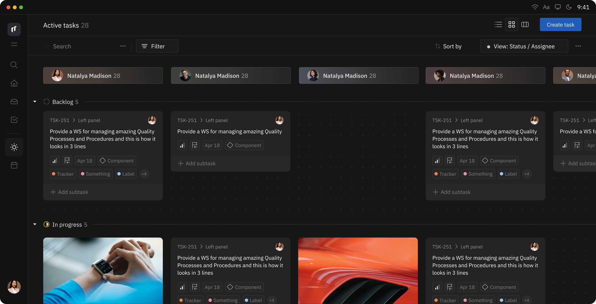

# Huly CI/CD pipeline

Deploy Huly server with CI/CD on Elestio

 
 

# Once deployed ...

You can open Huly UI here:

    URL: https://[CI_CD_DOMAIN]
    login: "[ADMIN_EMAIL]"
    password: "[ADMIN_PASSWORD]"
